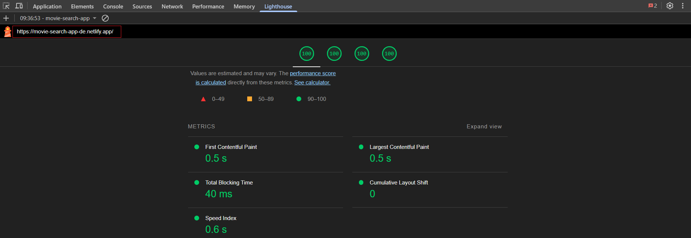

# 🎥 Movie Explorer

Movie Explorer is a web application that allows users to search, explore, and manage their favorite movies—especially those from Studio Ghibli. It features a modern UI, responsive design, user authentication, and state management for a smooth and personalized experience.

---

## 🚀 Features

### 🔧 Core Features

- 🔍 **Search Movies** – Find movies using a responsive, dynamic search bar.
- ⭐ **Favorites Management** – Add/remove favorite movies with persistent storage in `localStorage`.
- 📄 **Movie Details** – View detailed info including title, description, and ratings.

### 💡 UX Enhancements

- 🌙 **Theme Switching** – Toggle between light and dark themes.
- 🔔 **Snackbar Notifications** – Instant feedback for user actions.
- 📱 **Responsive Design** – Optimized for both desktop and mobile screens.
- 📚 **Pagination** – Easily navigate through large datasets of movies.

### 🔐 Authentication

- 🔑 **Firebase Login** – Secure Google-based login and logout functionality.

---

## 🛠️ Technologies Used

### 🖥️ Frontend

- **React** – For building dynamic user interfaces.
- **TypeScript** – Ensures type safety and better tooling.
- **Vite** – Fast builds and dev server.
- **Material-UI (MUI)** – Component library for responsive, accessible UI.
- **React Router** – For seamless client-side routing.
- **Axios** – For making API requests.

### 🗂️ State Management

**React Context API:**

- `FavoritesContext` – Manages user's favorite movies.
- `ThemeContext` – Handles theme switching.
- `AuthContext` – Manages authentication state.

### 🔐 Authentication

- **Firebase Authentication** – Enables secure Google Sign-In.

### 🌐 API Integration

- **Studio Ghibli API** – Primary source for movie data.
- **Custom API Utilities** – Functions for searching, filtering, and fetching movie details.

---

## ✅ Testing

- **Vitest** – Fast unit testing.
- **React Testing Library** – For testing UI components.
- **JSDOM** – Simulates browser environment for tests.

---

## 📦 Build and Tooling

- **Vite** – Handles build and dev server.
- **Husky** – Manages Git hooks (e.g., pre-commit linting).
- **Prettier** – Code formatting.
- **ESLint** – Enforces coding best practices.

---

## ⚡ Performance Optimization

- **vite-plugin-compression** – Gzip/Brotli asset compression.
- **Lazy Loading** – `React.lazy` + `Suspense` for on-demand component loading.

---

## 🔐 Security

- **Sanitization** – Custom utilities sanitize API data to prevent XSS.
- **Environment Variables** – Sensitive config stored securely in `.env`.
- **Data Storage** – Favorites stored encoded in `localStorage`; themes in plain text.

---

## 🌈 Accessibility

- **ARIA Attributes** – For better screen reader support.
- **eslint-plugin-jsx-a11y** – Enforces accessibility best practices.

---
## Live Demo

Check out the deployed version of the app: [Movie Search App](https://movie-search-app-de.netlify.app/)

# Lighthouse Score

Here’s the Lighthouse audit score for the app:




## Requirements

- **Node.js** v16 or higher
- **npm** or **yarn**

## How to Run the Project

1. **Clone the repository**:

    ```bash
    git clone <repository-url>
    cd movie-app
    ```

2. **Install dependencies**:

    ```bash
    npm install
    ```

3. **Create a `.env` file** in the root directory and add your Firebase configuration:

    ```env
    VITE_FIREBASE_API_KEY=your-api-key
    VITE_FIREBASE_AUTH_DOMAIN=your-auth-domain
    VITE_FIREBASE_PROJECT_ID=your-project-id
    VITE_FIREBASE_STORAGE_BUCKET=your-storage-bucket
    VITE_FIREBASE_MESSAGING_SENDER_ID=your-messaging-sender-id
    VITE_FIREBASE_APP_ID=your-app-id
    ```

4. **Start the development server**:

    ```bash
    npm run dev
    ```

5. **Build the project for production**:

    ```bash
    npm run build
    ```

6. **Run tests**:

    ```bash
    npm run test
    ```

---


